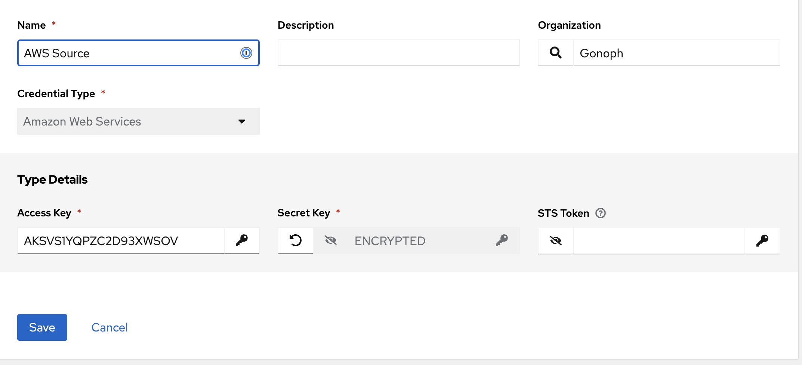

# Inventory AWS

This is an AWS sources inventory

* Log in to your AAP (point your browser to https://controller.example.local - but replace it with your controller URL).
* go to Credentials, select **Add**

 "AWS Credential"

* go to Inventories, select **Add** for each one.

* Name: AWS
* Organization: Gonoph
* Click **Save**
* Click **Sources** tab
* Click **Add** button

 "us-east-1 source"

* Copy text of [/inventories/test.aws_ec2.yml](/inventories/test.aws_ec2.yml) to **Source variables**.
* Click **Save**
* Click **Sync**
