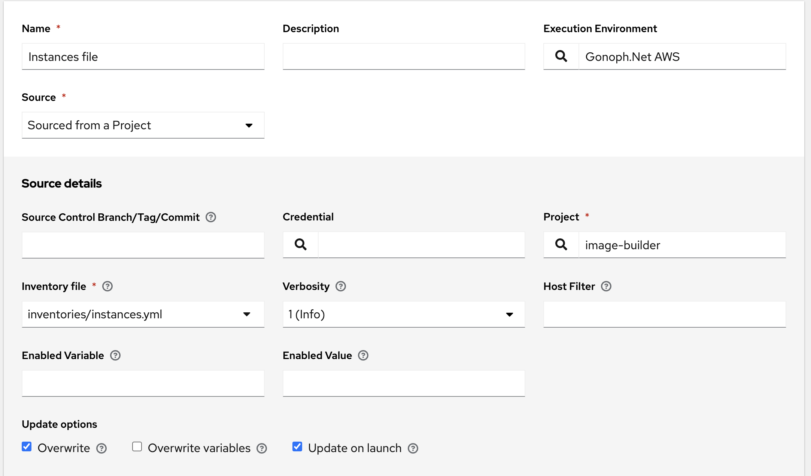

# Inventory EC2 Instances

This is a project and file based inventory.

* Log in to your AAP (point your browser to https://controller.example.local - but replace it with your controller URL).
* go to Inventories, select **Add** for each one.

* Name: EC2 Instances
* Organization: Gonoph
* Click **Save**
* Click **Sources** tab
* Click **Add** button

 "EC2 Instances"

* Click **Save**
* Click **Sync**
