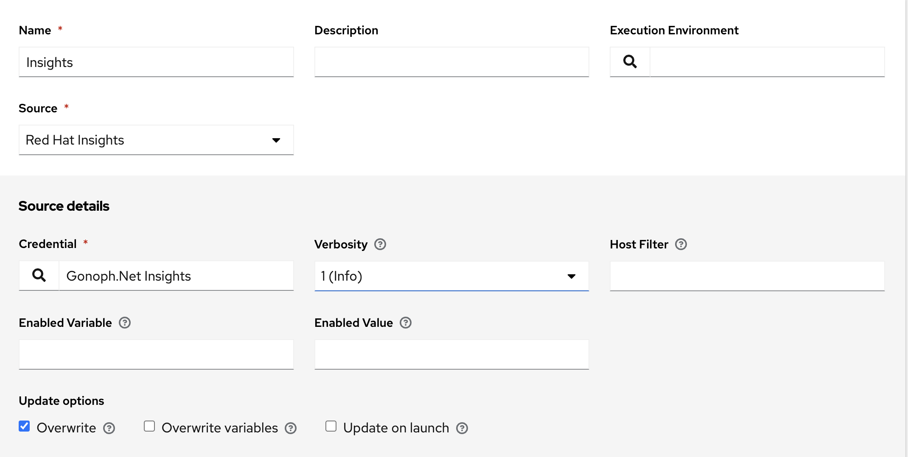

# Inventory Insights

This is an Insights sources inventory

* Log in to your AAP (point your browser to https://controller.example.local - but replace it with your controller URL).
* go to Credentials, select **Add**

 "Insights Credential"

* go to Inventories, select **Add** for each one.

* Name: Insights
* Organization: Gonoph
* Click **Save**
* Click **Sources** tab
* Click **Add** button

 "Insights source"

* Copy text of [/inventories/test.insights.yml](/inventories/test.insights.yml) to **Source variables**.
* Click **Save**
* Click **Sync**
