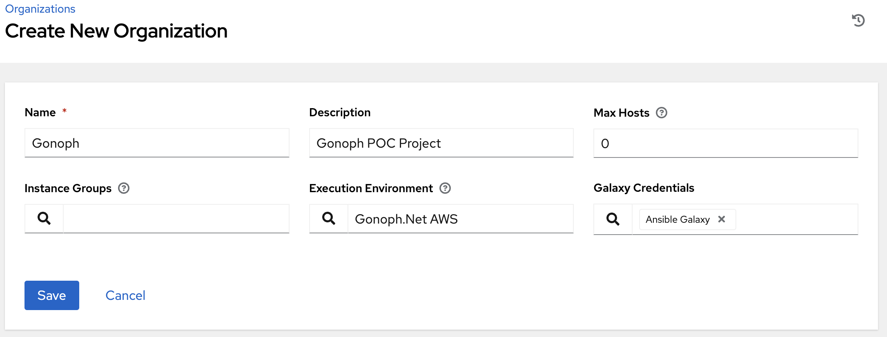

# Organizations setup

You don't have to do this, but I like to place my POC in it's own Organization.

## Setup a new Org in Controller

* Log in to your AAP (point your browser to https://controller.example.local - but replace it with your controller URL).
* go to Organizations, select **Add**.

 "Add Organization"

* You can create the [Gonoph.Net AWS EE here](/extras/gonoph-ee-aws/README.md)
* click **Save**
