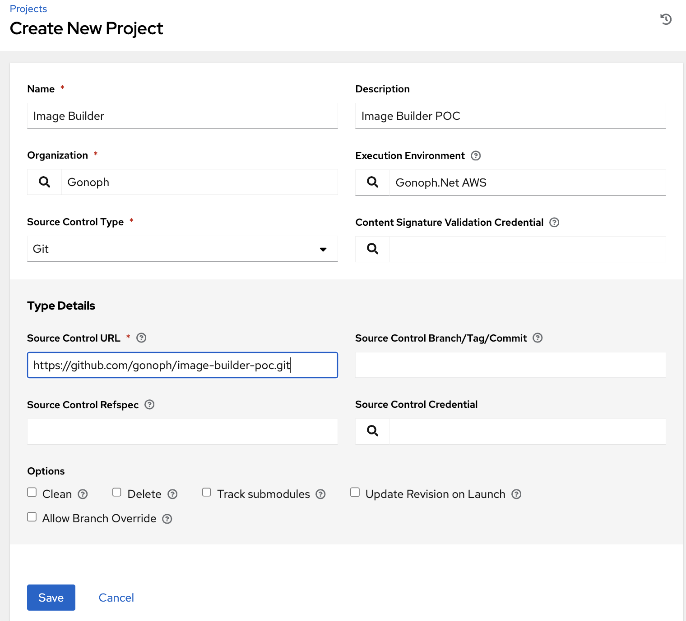

# Project setup

You will need a project in AAP before you can run any playbooks.

## Setup a new Project in Controller

* Log in to your AAP (point your browser to https://controller.example.local - but replace it with your controller URL).
* go to Projects, select **Add**.

 "Add Project"

* You can add the [Organization here](Organization.md)
* You can create the [Gonoph.Net AWS EE here](/extras/gonoph-ee-aws/README.md)
